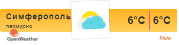
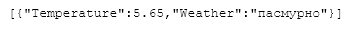
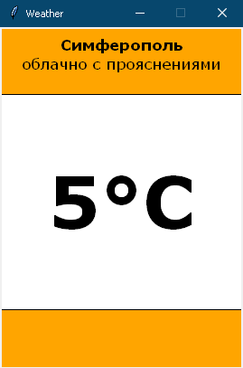

<p align="center">МИНИСТЕРСТВО НАУКИ  И ВЫСШЕГО ОБРАЗОВАНИЯ РОССИЙСКОЙ ФЕДЕРАЦИИ<br>
Федеральное государственное автономное образовательное учреждение высшего образования<br>
"КРЫМСКИЙ ФЕДЕРАЛЬНЫЙ УНИВЕРСИТЕТ им. В. И. ВЕРНАДСКОГО"<br>
ФИЗИКО-ТЕХНИЧЕСКИЙ ИНСТИТУТ<br>
Кафедра компьютерной инженерии и моделирования</p>
<br>
<h3 align="center">Отчёт по лабораторной работе № 1<br> по дисциплине "Программирование"</h3>
<br><br>
<p>студента 1 курса группы ИВТ-б-о-202(2)<br>
Вакарева Максима Викторовича<br>
направления подготовки 09.03.01 "Информатика и вычеслительная техника"</p>
<br><br>
<table>
<tr><td>Научный руководитель<br> старший преподаватель кафедры<br> компьютерной инженерии и моделирования</td>
<td>(оценка)</td>
<td>Чабанов В.В.</td>
</tr>
</table>
<br><br>
<p align="center">Симферополь, 2020</p>
<hr>

### Цель:

1. Закрепить навыки разработки многофайловыx приложений;
2. Изучить способы работы с API web-сервиса;
3. Изучить процесс сериализации/десериализации данных в/из json;
4. Получить базовое представление о сетевом взаимодействии приложений;

## Постановка задачи
Разработать сервис предоставляющий данные о погоде в городе Симферополе на момент запроса. В качестве источника данных о погоде используйте: [http://openweathermap.org/](http://openweathermap.org/). В состав сервиса входит: серверное приложение на языке С++ и клиентское приложение на языке Python.

Серверное приложение (далее Сервер) предназначенное для обслуживания клиентских приложений и минимизации количества запросов к сервису _openweathermap.org_. Сервер должен обеспечивать возможность получения данных в формате JSON и виде _html_ виджета (для вставки виджета на страницу будет использоваться _[iframe](https://habr.com/ru/post/488516/)_).

Клиентское приложение должно иметь графический интерфейс отображающий сведения о погоде и возможность обновления данных по требованию пользователя.

## Выполнение работы
1. Зарегистрировался на сайте http://openweathermap.org/ в разделе My API Keys получил свой API ключ для получения данных с сайта:

>f9644bd2dc049e034c102c9b65ccff2b
2. Составил запрос для получения почасового прогноза погоды:

>http://api.openweathermap.org/data/2.5/onecall?lat=44.95212&lon=34.10242&units=metric&exclude=minutely,daily,alerts,current&lang=ru&appid=f9644bd2dc049e034c102c9b65ccff2b
3. Составил запрос для получения текущего времени в Симферополе:

>http://worldtimeapi.org/api/timezone/Europe/Simferopol
4. Сделал сервер на языке С++, который при запуске получает данные о погоде и сохраняет их в кэш, далее слушает запросы на localhost:3000 и localhost:3000/raw.
При запросе "/" сервер берет шаблон html винджета из папки с сервером, делает запрос на *worldtimeapi.org* получает ответ с текущим временем, ищет в кэше погоду на начало следующего часа,
если такой прогноз отсутсвует, обновляет данные в кэше и проводит поиск заново. Если прогноз сущетствует кэширует время из прогноза и формирует ответ ввиде изменненого шаблона винджета. 
В последующих запросах сравнивает кэшированное время с текущим, если текущее время меньше кэшированного, возвращает тот же изменненный шаблон (см. рис. 1), для того чтобы не проходить по циклу поиска прогноза при каждом обновлении страницы.
При запросе "/raw" сервер делает запрос на *worldtimeapi.org* получает ответ с текущим временем, ищет в кэше погоду на начало следующего часа,
если такой прогноз отсутсвует, обновляет данные в кэше и проводит поиск заново. Если прогноз сущетствует кэширует время из прогноза и формирует ответ ввиде JSON с данными о температуре и погоде (см. рис. 2). 
В последующих запросах сравнивает кэшированное время с текущим, если текущее время меньше кэшированного, возвращает тот же JSON ответ, для того чтобы не проходить по циклу поиска прогноза при каждом обновлении страницы.
Для работы с Web запросами использовалась библиотека *https://github.com/yhirose/cpp-httplib* , для работы с JSON библиотека *https://github.com/nlohmann/json* .
Код C++ сервера:
```C++
#include <iostream>
#include <json.hpp>
#include <httplib.h>
#include <iomanip>
#include <string>
#include <fstream>

using namespace httplib;
using namespace nlohmann;
using namespace std;

string GetWeather() {
    Client Web("http://api.openweathermap.org");
    auto res = Web.Get("/data/2.5/onecall?lat=44.95212&lon=34.10242&units=metric&exclude=minutely,daily,alerts,current&lang=ru&appid=f9644bd2dc049e034c102c9b65ccff2b");
    if (res) {
        if (res->status == 200) {
            return res->body;
        }
        else {
            return 0;
        }
    }
    else {
        return 0;
    }
}
string GetTime() {
    Client Web("http://worldtimeapi.org");
    auto res = Web.Get("/api/timezone/Europe/Simferopol");
    if (res) {
        if (res->status == 200) {
            return (res->body);
        }
        else {
            return 0;
        }
    }
    else {
        return 0;
    }
}

int main()
{
   json raw = json::parse(GetWeather()); // Получаем json погоды
   int BufTime = 0;
   int BufTime2 = 0;
   json RES;

   ifstream File("widget_template.html"); // Шаблон виджета
   string str;
   getline(File, str, '\0'); // Читаем шаблон в строку

   Server Weather;  // стартуем сервер
   Weather.Get("/raw", [&](const httplib::Request&, httplib::Response& res) { // При открытие /raw
       json time = json::parse(GetTime()); // Получаем json времени
       if (int(time["unixtime"]) < BufTime);    // Чтобы не проходить каждый раз по циклу
       else {
           for (int i = 0; i < raw["hourly"].size(); i++) {
               if (int(time["unixtime"]) < int(raw["hourly"][i]["dt"])) { // Сравниваем время
                   RES.push_back({ {"Temperature", raw["hourly"][i]["temp"]},  {"Weather", raw["hourly"][i]["weather"][0]["description"] } }); // создаем конечный json
                   BufTime = raw["hourly"][i]["dt"]; // кэшируем отдельно время
                   break;
               }
               else {
                   raw = json::parse(GetWeather());     // Если в кэше устарело
                   i = 0;
               }
           }
       }
        res.set_content(RES.dump(), "text/json");   // отдаем итоговый json
        });
   Weather.Get("/", [&](const httplib::Request&, httplib::Response& res) { // При открытие корня
       json time = json::parse(GetTime());// Получаем json времени
       if (int(time["unixtime"]) < BufTime2); // Чтобы не проходить каждый раз по циклу
       else {
           for (int i = 0; i < raw["hourly"].size(); i++) { 
               if (int(time["unixtime"]) < int(raw["hourly"][i]["dt"])) { // Сравниваем время

                   str.replace(str.find("{hourly[i].temp}"), size("{hourly[i].temp}")-1, to_string(int(round(raw["hourly"][i]["temp"].get<float>())))); // Находим в строке первую встречу с временем, заменяем на элемент из json
                   str.replace(str.find("{hourly[i].temp}", size("{hourly[i].temp}")), size("{hourly[i].temp}") - 1, to_string(int(round(raw["hourly"][i]["temp"].get<float>())))); // Находим в строке вторую встречу с временем, заменяем на элемент из json
                   str.replace(str.find("{hourly[i].weather[0].description}"), size("{hourly[i].weather[0].description}") - 1, raw["hourly"][i]["weather"][0]["description"].get<string>()); // Аналогично предыдущему
                   str.replace(str.find("{hourly[i].weather[0].icon}"), size("{hourly[i].weather[0].icon}") - 1, raw["hourly"][i]["weather"][0]["icon"].get<string>()); // Аналогично предыдущему
                  
                   BufTime2 = raw["hourly"][i]["dt"]; // кэшируем время
                   break;
               }
               else {
                   raw = json::parse(GetWeather()); // если устарел кэш
                   i = 0;
               }
           }
       }
       res.set_content(str, "text/html"); // отдаем измененный шаблон
       });
   std::cout << "Start server... OK\n";
   Weather.listen("localhost", 3000); // слушаем локалку на 3000 порте

}
```
<p align="center">  </p>
<p align="center"> Рисунок 1 - HTML виджет </p> </br>

<p align="center">  </p>
<p align="center"> Рисунок 2 - JSON ответ </p> </br>

5. Сделал клиенское приложение с графическим интерфейсом на языке Python (см. рис. 3). Приложение отправляет запрос "/raw" на сервер, в ответ получает данные о температуре и погоде, сохраняет их в кэш.
Выводит	текст с текущей погодой и температурой округляя ее до целого числа. При клике мышкой в любой точке интерфейса, приложение повторно отправляет запрос на сервер, обновляя данные в кеше.
Для работы с JSON в Python использовался модуль json, для создания графического интерфейса использовалась библиотека tkinter, для создания request запросов использовался модуль requests. Код клиенского Python приложения:
```Python
from tkinter import *
from tkinter.font import BOLD
import requests 
import json
import math

response = requests.get('http://localhost:3000/raw')
obj = json.loads(response.text)
def on_click(event):
    response = requests.get('http://localhost:3000/raw')
    obj = json.loads(response.text)
window = Tk()
window.title("Weather")
window.resizable(width=False, height=False)
c = Canvas(window, width=269, height=378, bg='white')
c.pack()
c.create_rectangle(0, 0, 269, 74,
                   fill='orange')
c.create_rectangle(0, 312, 269, 378,
                   fill='orange')
c.create_text(135, 19, 
              text="Симферополь",
              justify=CENTER, font=('Verdana', 13, BOLD))
c.create_text(135, 40, 
              text=obj[0]['Weather'].encode('l1').decode(),
              justify=CENTER, font=('Verdana', 13))
c.create_text(135, 190, 
              text=(str(round(obj[0]['Temperature']))+u"\u00b0C"),
              justify=CENTER, font=('Verdana', 60, BOLD))       
c.bind("<Button-1>", on_click)           
window.geometry('269x378')
window.mainloop()
```
<p align="center">  </p>
<p align="center"> Рисунок 3 - Интерфейс клиенского приложения </p> </br>

6. Для защиты работы скачал программу ngrok, протестировал ее работоспособность.

**Вывод:** Получил опыт работы с API, закрепил навыки разработки многофайловыx приложений. Разобрался в сетевом взаимодействии приложений, принципе работы Request запросов.
Получил дополнительный опыт работы с json, изучил процесс сериализации/десериализации данных в/из json. Узнал о возможности разработки приложений с графический интерфейсом на языке
Python и получил практический опыт в разработке подобных приложений.