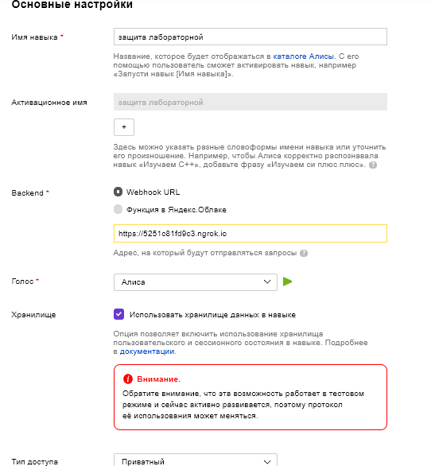
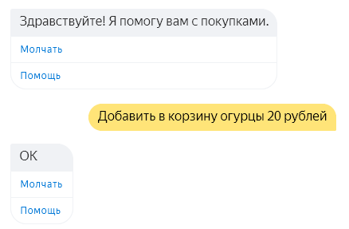
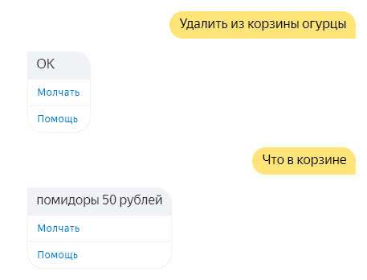
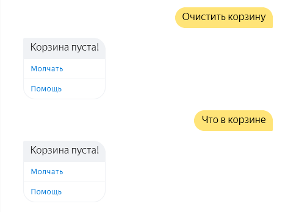
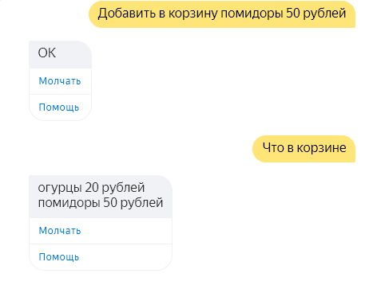
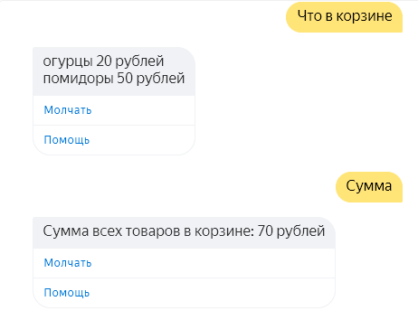
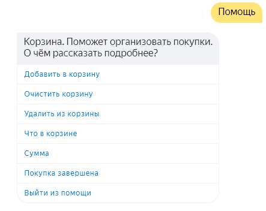
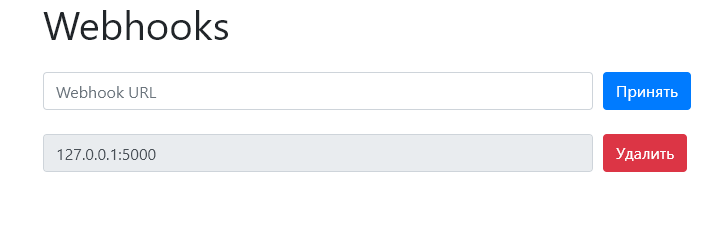

<p align="center">МИНИСТЕРСТВО НАУКИ  И ВЫСШЕГО ОБРАЗОВАНИЯ РОССИЙСКОЙ ФЕДЕРАЦИИ<br>
Федеральное государственное автономное образовательное учреждение высшего образования<br>
"КРЫМСКИЙ ФЕДЕРАЛЬНЫЙ УНИВЕРСИТЕТ им. В. И. ВЕРНАДСКОГО"<br>
ФИЗИКО-ТЕХНИЧЕСКИЙ ИНСТИТУТ<br>
Кафедра компьютерной инженерии и моделирования</p>
<br>
<h3 align="center">Отчёт по лабораторной работе № 2<br> по дисциплине "Программирование"</h3>
<br><br>
<p>студента 1 курса группы ИВТ-б-о-202(2)<br>
Вакарева Максима Викторовича<br>
направления подготовки 09.03.01 "Информатика и вычеслительная техника"</p>
<br><br>
<table>
<tr><td>Научный руководитель<br> старший преподаватель кафедры<br> компьютерной инженерии и моделирования</td>
<td>(оценка)</td>
<td>Чабанов В.В.</td>
</tr>
</table>
<br><br>
<p align="center">Симферополь, 2020</p>
<hr>

### Цель:

1. Получить представления о структуре post-запроса;
2. Изучить webhooks как метод взаимодействия web-приложений;

## Постановка задачи
1. Разработать и зарегистровать навык для Алисы на сервисе Яндекс Диалоги;
2. В качестве backend-a для навыка реализовать приложение на языке С++ выполняющее следующие функции:
    1. Составление продуктовой корзины:
        * Добавление продукта в корзину;
        * Удаление продукта из корзины;
        * Очистка корзины;
        * Вывод списка товаров в корзине;
        * Подсчёт стоимости товаров в корзине.
    2. Вывод справочной информации по навыку;
    3. Регистрацию webhook-ов сторонних сервисов;
    4. Отправку данных на сторонние сервисы. 
3. В качестве стороннего сервиса реализуйте приложение на языке Python выполняющее следующие функции:
    1. Ожидание данных о покупке;
    2. Сохранение поступивших данных в excel-документ.

## Выполнение работы
1. Зарегистрировался на сайте http://yandex.ru/ в сервисе https://dialogs.yandex.ru/ создал новый навык для Яндекс Алисы, основные настройка навыка видно на рисунке 1:

<p align="center">  </p>
<p align="center"> Рисунок 1 - Основные настройки навыка в сервисе Яндекс Диалоги </p> </br>

2. Сделал сервер на языке С++, который при запуске ждет запросов от навыка Алисы, сервер отвечает на периодическую проверку от сервиса. При старте новой
сессии сервер отправляет приветственное сообщение и выводит две кнопки: "Молчать" и "Помощь". Если пользователь нажимает на кнопку "Молчать" в последующих ответах
сервер перестанет отправлять строку tts отвечающую за озвучивание текста, а кнопка меняет название на "Говорить" и выполняет обратную функцию. Нажав на кнопку "Помощь"
сервер переводит сессию в режим помощи, выводиться приветственное сообщение данного режима и кнопки отвечающие за описание возможностей навыка и выход из режима помощи.
Сервер предоставляет следующие возможности использования навыка: добавить в корзину - добавляет элемент JSON массив состоящего из названия и стоимости, удалить из корзины - 
удаляет элемент из массива, очистить корзину - очищает весь массив, что в корзине - выводит все элементы массива, сумма - сумирует все элементы массива из значения стоимости и выводит результат,
покупка заверщена - отправляет JSON состоящий из ид пользователя навыка и ранее созданного массива товаров, всем вебхукам (см. рис. 2 - 7). Так же сервер слушает GET и POST запросы по адрессу "/webhooks"
при переходе на данный адресс, сервер отправляет заполенный HTML шаблон с настройкой вебхуков которым будет оправляться итоговый JSON (см. рис. 8). Для работы с Web запросами использовалась 
библиотека https://github.com/yhirose/cpp-httplib , для работы с JSON библиотека https://github.com/nlohmann/json .

Код C++ сервера:
```C++
#include <iostream>
#include <httplib.h>
#include <json.hpp>
#include <string>
#include <iomanip>
#include <fstream>

using namespace httplib;
using json = nlohmann::json;


json Create(std::string str, json state, bool session, json buttons) {
    json Responce;
    Responce["response"]["text"] = str;
	Responce["response"]["tts"] = "sil <[500]>";
    if (state["Silence"] == false)
        Responce["response"]["tts"] = str;
    Responce["response"]["buttons"] = buttons;
    Responce["response"]["end_session"] = session;
    Responce["version"] = "1.0";
    Responce["session_state"] = state;
   
    return Responce;
}

std::vector<std::string> GetCommand(json token) {
    std::vector<std::string> Res;
    for (auto i : token) {
        Res.push_back(i);
    }
    return Res;
}

std::string replace(std::string str, std::string source, std::string get) {
    int start = str.find(source);
    return str.replace(start, source.length(), get);
}

json GetMain(json req) {
    json State;
    State["Silence"] = false;
    State["Check"] = json::array();
    State["Mode"] = "Main";

    std::string STR = u8"Здравствуйте! Я помогу вам с покупками.";

    json Btns = json::array();
    Btns[0]["title"] = u8"Молчать";
    Btns[1]["title"] = u8"Помощь";
    Btns[1]["payload"]["Mode"] = "Help";

    json ActiveBtns = json::array();
    ActiveBtns[0]["title"] = u8"Добавить в корзину";
    ActiveBtns[0]["payload"]["Help"] = "Add";
    ActiveBtns[1]["title"] = u8"Очистить корзину";
    ActiveBtns[1]["payload"]["Help"] = "Clear";
    ActiveBtns[2]["title"] = u8"Удалить из корзины";
    ActiveBtns[2]["payload"]["Help"] = "Del";
    ActiveBtns[3]["title"] = u8"Что в корзине";
    ActiveBtns[3]["payload"]["Help"] = "What";
    ActiveBtns[4]["title"] = u8"Сумма";
    ActiveBtns[4]["payload"]["Help"] = "Sum";
    ActiveBtns[5]["title"] = u8"Покупка завершена";
    ActiveBtns[5]["payload"]["Help"] = "End";
    ActiveBtns[6]["title"] = u8"Выйти из помощи";
    ActiveBtns[6]["payload"]["Help"] = "EndHelp";


    if (req["session"]["new"] == true) {
        return Create(STR, State, false, Btns);
    }


    State["Silence"] = req["state"]["session"]["Silence"];
    State["Check"] = req["state"]["session"]["Check"];
    State["Mode"] = req["state"]["session"]["Mode"];

    if (State["Silence"] == false) Btns[0]["title"] = u8"Молчать";
    else if (State["Silence"] == true) Btns[0]["title"] = u8"Говорить";

    if (req["session"]["new"] == false) {
            std::vector<std::string> BUF1 = GetCommand(req["request"]["nlu"]["tokens"]);
            if (BUF1.size() == 1 && BUF1[0] == u8"помощь") State["Mode"] = "Help";

            if (req["request"]["payload"]["Mode"] == "Help" || State["Mode"] == "Help") {
                
                State["Mode"] = "Help";
                STR = u8"Корзина. Поможет организовать покупки. \nО чём рассказать подробнее?";

                if (BUF1.size() == 1 && BUF1[0] == u8"помощь") STR = u8"Корзина. Поможет организовать покупки. \nО чём рассказать подробнее?";

                else if (req["request"]["payload"]["Help"] == "Add" || BUF1.size() > 0 && BUF1[0] == u8"добавить" && BUF1[1] == u8"в" && BUF1[2] == u8"корзину") {
                    STR = u8"Команда добавить в корзину, добавляет указанный вами товар к вам в корзину. \nО чём рассказать еще?";
                }
                else if (req["request"]["payload"]["Help"] == "Clear" || BUF1.size() > 0 && BUF1[0] == u8"очистить" && BUF1[1] == u8"корзину") {
                    STR = u8"Команда очистить корзину, удаляет все товары из корзины. \nО чём рассказать еще?";
                }
                else if (req["request"]["payload"]["Help"] == "Del" || BUF1.size() > 0 && BUF1[0] == u8"удалить" && BUF1[1] == u8"из" && BUF1[2] == u8"корзины") {
                    STR = u8"Команда Удалить из корзины, удаляет указанный вами товар из корзины. \nО чём рассказать еще?";
                }
                else if (req["request"]["payload"]["Help"] == "What" || BUF1.size() > 0 && BUF1[0] == u8"что" && BUF1[1] == u8"в" && BUF1[2] == u8"корзине") {
                    STR = u8"Команда что в корзине, выводит все товары имеюзиеся в корзине. \nО чём рассказать еще?";
                }
                else if (req["request"]["payload"]["Help"] == "Sum" || BUF1.size() > 0 && BUF1.size() == 1 && BUF1[0] == u8"сумма") {
                    STR = u8"Команда сумма, выводит суммарную стоимость всех товаров. \nО чём рассказать еще?";
                }
                else if (req["request"]["payload"]["Help"] == "End" || BUF1.size() > 0 && BUF1.size() == 2 && BUF1[0] == u8"покупка" && BUF1[1] == u8"завершена") {
                    STR = u8"Команда покупка завершена, завершает покупку. \nО чём рассказать еще?";
                }
                else if (req["request"]["payload"]["Help"] == "EndHelp" || BUF1.size() > 0 && BUF1[0] == u8"выйти" && BUF1[1] == u8"из" && BUF1[2] == u8"помощи") {
                    STR = u8"Обращайся ещё!";
                    State["Mode"] = "Main";
                    return Create(STR, State, false, Btns);
                }
                else if (req["request"]["payload"]["Mode"] != "Help") STR = u8"Неизвестная команда";
                return Create(STR, State, false, ActiveBtns);
            }

            else if (req["request"]["payload"]["Mode"] == "Main" || req["state"]["session"]["Mode"] == "Main") {
                
                State["Mode"] = "Main";
                std::vector<std::string> BUF = GetCommand(req["request"]["nlu"]["tokens"]);

                if (BUF[0] == u8"добавить" && BUF[1] == u8"в" && BUF[2] == u8"корзину") {
                    int Start = req["request"]["nlu"]["entities"][0]["tokens"]["start"];
                    std::vector<std::string> RESULT = {};
                    std::string RESSTR = "";
                    for (int i = Start - 1; i > 0; --i) {
                        if (BUF[i] != u8"корзину") {
                            RESULT.insert(RESULT.begin(), BUF[i]);
                        }
                        else break;
                    }
                    for (int i = 0; i < RESULT.size(); i++) {
                        if (i < (RESULT.size() - 1)) {
                            RESSTR += RESULT.at(i) + u8" ";
                        }
                        else {
                            RESSTR += RESULT.at(i);
                        }
                    }
                    State["Check"].push_back({ {"item", RESSTR}, {"price", req["request"]["nlu"]["entities"][0]["value"] } });
                    STR = u8"ОК";
                }
                else if (BUF[0] == u8"удалить" && BUF[1] == u8"из" && BUF[2] == u8"корзины") {
                    bool OK = false;
                    std::vector<std::string> RESULT2 = {};
                    std::string RESSTR2 = "";
                    for (int i = BUF.size()-1; i > 0; --i) {
                        if (BUF[i] != u8"корзины") {
                            RESULT2.insert(RESULT2.begin(), BUF[i]);
                        }
                        else break;
                    }
                    for (int i = 0; i < RESULT2.size(); i++) {
                        if (i < (RESULT2.size() - 1)) {
                            RESSTR2 += RESULT2.at(i) + u8" ";
                        }
                        else {
                            RESSTR2 += RESULT2.at(i);
                        }
                    }
                    for (int i = 0; i < State["Check"].size(); i++) {
                        if (State["Check"][i]["item"] == RESSTR2) {
                            State["Check"].erase(i);
                            OK = true;
                        }
                    }
                    if (OK == true) STR = u8"ОК";
                    else STR = u8"Такого предмета нет в корзине!";
                }
                else if (BUF[0] == u8"очистить" && BUF[1] == u8"корзину") {
                    State["Check"].clear();
                    STR = u8"Корзина пуста!";
                }
                else if (BUF[0] == u8"что" && BUF[1] == u8"в" && BUF[2] == u8"корзине") {
                    if (State["Check"].size() <= 0) {
                        STR = u8"Корзина пуста!";
                    }
                    else if (State["Check"].size() > 0) {
                        std::stringstream str;
                        for (int i = 0; i < State["Check"].size(); i++){
                            str << std::string(State["Check"][i]["item"]) << u8" " << State["Check"][i]["price"] << u8" рублей" << "\n";
                        }
                        STR = str.str();
                    }
                }
                else if (BUF.size() == 1 && BUF[0] == u8"сумма") {
                    int sum = 0;
                    int num;
                    for (int i = 0; i < State["Check"].size(); i++) {
                        num = State["Check"][i]["price"];
                        sum += num;
                    }
                    STR = u8"Сумма всех товаров в корзине: " + std::to_string(sum) + u8" рублей";
                }
                else if (BUF.size() == 2 && BUF[0] == u8"покупка" && BUF[1] == u8"завершена") {

                    STR = u8"Заходите ещё";
                    if (State["Check"].size() > 0) {
                        std::ifstream jsnout("webhooks.json");

                        json Check;

                        Check["check"] = State["Check"];
                        if (req["session"]["user"]["user_id"] == nullptr) {
                            Check["user_id"] = "anonymous";
                            //Check.push_back("{\"user_id\": \"anonymous\"}"_json);
                        }
                        else if (req["session"]["user"]["user_id"] != nullptr) {
                            Check["user_id"] = req["session"]["user"]["user_id"];
                        }

                        json JArr;
                        JArr["WebHooks"] = json::array();

                        if (jsnout) {
                            json j = json::parse(jsnout);
                            for (int i = 0; i < j["WebHooks"].size(); i++) {
                                JArr["WebHooks"].push_back(j["WebHooks"][i]);
                            }
                            jsnout.close();
                        }


                        for (int i = 0; i < JArr["WebHooks"].size(); i++) {
                            std::string addr = JArr["WebHooks"][i];
                            Client cli(addr.c_str());
                            std::stringstream ss;
                            std::stringstream ss2;
                            ss << std::setw(2) << Check;
                            std::string strstate = ss.str();
                            auto res = cli.Post("/", strstate, "application/json");
                        }
                    }
                    return Create(STR, State, true, nullptr);
                }
                else if (BUF.size() == 1 && BUF[0] == u8"молчать") {
                    State["Silence"] = true;
                    Btns[0]["title"] = u8"Говорить";
                    STR = u8"Молчу, молчу";
                }
                else if (BUF.size() == 1 && BUF[0] == u8"говорить") {
                    State["Silence"] = false;
                    Btns[0]["title"] = u8"Молчать";
                    STR = u8"Хорошо";
                }
                else STR = u8"Неизвестная команда";


                return Create(STR, State, false, Btns);
            }
        }
}

void Get_Session(const Request& req, Response& res) {
    json REQ = json::parse(req.body);
    std::stringstream str;
    str << std::setw(2) << GetMain(REQ) << std::endl;
    res.set_content(str.str(), "text/json; charset=UTF-8");
}

void Get_Template(const Request& req, Response& res) {
    std::ifstream ifstr("temp.html");
    std::string temp;
    std::getline(ifstr, temp, '\0');
    ifstr.close();


    std::ifstream iftempl("template.html");
    std::string templated;
    std::getline(iftempl, templated, '\0');
    iftempl.close();

    std::string data = "";

    std::ifstream jsnout("webhooks.json");
    
    json JArr;
    JArr["WebHooks"] = json::array();

    if (jsnout) {
        json j = json::parse(jsnout);
        for (int i = 0; i < j["WebHooks"].size(); i++) {
            JArr["WebHooks"].push_back(j["WebHooks"][i]);
        }
        jsnout.close();
    }
   
    for (int i = 0; i < JArr["WebHooks"].size(); i++) {
        std::string tempM = temp;
        tempM.replace(tempM.find("Webhook URL"), std::size("Webhook URL") - 1, JArr["WebHooks"][i]);
        tempM.replace(tempM.find("Webhook URL"), std::size("Webhook URL") - 1, JArr["WebHooks"][i]);
        data += tempM + "\n";
    }
    std::string tempP = templated;
    tempP.replace(tempP.find("{webhooks_list}"), std::size("{webhooks_list}"), data);

    if (req.method == "POST") {
        if (req.has_param("del")) {
            std::string value = req.get_param_value("del");
            for (int i = 0; i < JArr["WebHooks"].size(); i++) {
                if (JArr["WebHooks"][i] == value) {
                    JArr["WebHooks"].erase(JArr["WebHooks"].begin() + i);
                }
            }
            std::stringstream sd;
            sd << std::setw(2) << JArr;

            std::ofstream kj("webhooks.json");
            kj << sd.str() << std::endl;
            kj.close();
        }
        if (req.has_param("set")) {
            std::string value = req.get_param_value("set");
            JArr["WebHooks"].push_back(value);
            std::stringstream sd;
            sd << std::setw(2) << JArr;

            std::ofstream kj("webhooks.json");
            kj << sd.str() << std::endl;
            kj.close();
        }
        res.set_redirect("#");
    }

    res.set_content(tempP, "text/html");
}

int main() {
    Server svr;                            
    svr.Post("/", Get_Session);      
    svr.Post("/webhooks", Get_Template);
    svr.Get("/webhooks", Get_Template);
    std::cout << "Start server... OK\n";
    svr.listen("localhost", 3000);         
}
```
<p align="center">  </p>
<p align="center"> Рисунок 2 - Функция навыка "Добавить в корзину" </p> </br>

<p align="center">  </p>
<p align="center"> Рисунок 3 - Функция навыка "Удалить из корзины" </p> </br>

<p align="center">  </p>
<p align="center"> Рисунок 4 - Функция навыка "Очистить корзину" </p> </br>

<p align="center">  </p>
<p align="center"> Рисунок 5 - Функция навыка "Что в корзине" </p> </br>

<p align="center">  </p>
<p align="center"> Рисунок 6 - Функция навыка "Сумма" </p> </br>

<p align="center">  </p>
<p align="center"> Рисунок 7 - Режим помощи </p> </br>

<p align="center">  </p>
<p align="center"> Рисунок 8 - Настройка вебхуков </p> </br>

3. Сделал клиенское приложение на языке Python. Приложение ждет POST запрос по адрессу "/", получив его, смотрит JSON ли это, если да то записывает в массив буфер, так же добавляет к каждому элементу JSON массива параметр "datatime" в который записывет текущую дату и время на момент получения данных.
Когда размер массива становиться равным указанному значению, по заданию 1000, приложение с помощью библиотеки Openpyxl пытается открыть Exel документ data.xlsx если он отсутствует создает новый
в котором находиться шапка документа требуемая по заданию и данные из буфера, распределенные по соответствующим столбцам и ячейкам. Пример Exel документа: [Документ. ](./doc/data.xlsx)
Код клиенского Python приложения:
```Python
from flask import Flask, request
from datetime import datetime
import openpyxl
from openpyxl.styles import Alignment, Font

Buf_Size = 2
buf = []

def FindClearRow(page, col):
    i = 1
    while True:
        if type(page[i][col]).__name__ == 'MergedCell':
            i += 1
        else:
            if page[i][col].value != None:
                i += 1
            else:
                break
    return i

def writeinbuf(Res):
    global buf
    global Buf_Size
    buf.append(Res);
    buf[-1]["datetime"] = datetime.now().strftime("%d/%m/%Y %H:%M:%S")
    if len(buf) >= Buf_Size:
        try:
            book = openpyxl.open("data.xlsx", read_only=False)
        except:
            book = openpyxl.Workbook()
        page = book.active
        if page.title != "Alice":
        
            page.title = "Alice"
            page['A1'] = "N"
            page['B1'] = "User ID"
            page['C1'] = "Datetime"
            page['D1'] = "Item"
            page['E1'] = "Price"
            
            page.column_dimensions['A'].width = 5
            page.column_dimensions['B'].width = 67
            page.column_dimensions['C'].width = 18
            page.column_dimensions['D'].width = 30
            page.column_dimensions['E'].width = 13
            
            page[1][0].alignment = Alignment(horizontal='center', vertical='center')
            page[1][1].alignment = Alignment(horizontal='center', vertical='center')
            page[1][2].alignment = Alignment(horizontal='center', vertical='center')
            page[1][3].alignment = Alignment(horizontal='center', vertical='center')
            page[1][4].alignment = Alignment(horizontal='center', vertical='center')
            page[1][0].font = Font(bold=True)
            page[1][1].font = Font(bold=True)
            page[1][2].font = Font(bold=True)
            page[1][3].font = Font(bold=True)
            page[1][4].font = Font(bold=True)
            
        for i in range(len(buf)):
        
            N = FindClearRow(page, 0)
            OLD = N
            while True:
                N -= 1
                if type(page[N][0]).__name__ == 'Cell':
                    if str(page[N][0].value).isdigit():
                        page[OLD][0].value = page[N][0].value + 1
                        page[OLD][0].alignment = Alignment(horizontal='center', vertical='center')
                        break
                    else:
                        page[OLD][0].value = 1
                        page[OLD][0].alignment = Alignment(horizontal='center', vertical='center')
                        break
                
            UID = FindClearRow(page, 1)
            page[UID][1].value = buf[i]["user_id"]
            page[UID][1].alignment = Alignment(horizontal='center', vertical='center')
            
            DateT = FindClearRow(page, 2)
            page[DateT][2].value = buf[i]["datetime"]
            page[DateT][2].alignment = Alignment(horizontal='center', vertical='center')
            
            Leng = len(buf[i]["check"])
            page.merge_cells(start_row=OLD, start_column=1, end_row=OLD+Leng-1, end_column=1)
            page.merge_cells(start_row=OLD, start_column=2, end_row=OLD+Leng-1, end_column=2)
            page.merge_cells(start_row=OLD, start_column=3, end_row=OLD+Leng-1, end_column=3)
            
            for K in range(len(buf[i]["check"])):
                Itm = FindClearRow(page, 3)
                page[Itm][3].value = buf[i]["check"][K]["item"]
                page[Itm][3].alignment = Alignment(horizontal='center', vertical='center')
                page[Itm][4].value = int(buf[i]["check"][K]["price"])
                page[Itm][4].alignment = Alignment(horizontal='center', vertical='center')    
        book.save("data.xlsx")
        buf = []

app = Flask(__name__)

@app.route('/', methods=['POST'])
def index():
    if request.method == 'POST':
        if request.is_json:
            Res = request.get_json()
            writeinbuf(Res)
            return "OK"
 
if __name__ == "__main__":
    app.run()
```

6. Для защиты работы скачал программу ngrok, протестировал ее работоспособность.

**Вывод:** Получил опыт работы с webhooks методом взаимодействия web-приложений, закрепил навыки разработки многофайловыx приложений. 
Получил представления о структуре post-запроса. Получил практические навыки в разработке навыков для сервиса Яндекс Диалоги. Более детально изучил
документации библиотек для C++: JSON for Modern C++ и cpp-httplib, а так же получил опыт работы с новыми библиотками для Python: Openpyxl, Flask.