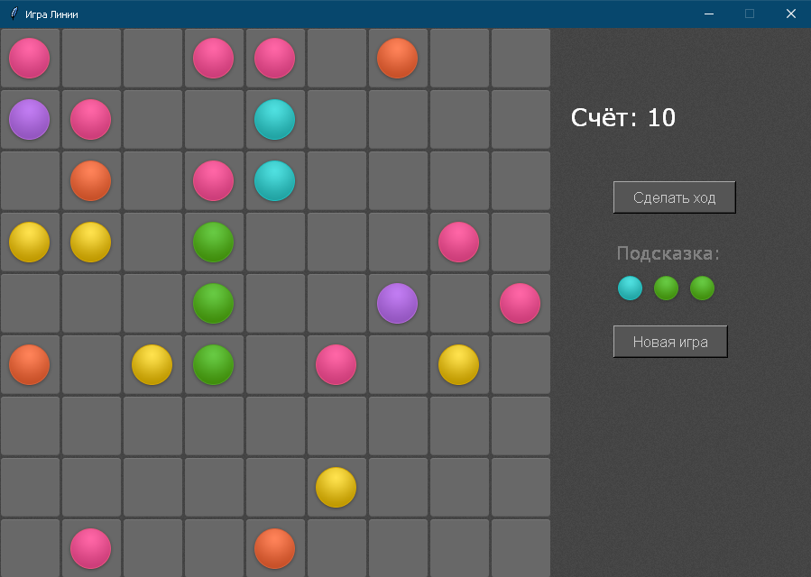

<p align="center">МИНИСТЕРСТВО НАУКИ  И ВЫСШЕГО ОБРАЗОВАНИЯ РОССИЙСКОЙ ФЕДЕРАЦИИ<br>
Федеральное государственное автономное образовательное учреждение высшего образования<br>
"КРЫМСКИЙ ФЕДЕРАЛЬНЫЙ УНИВЕРСИТЕТ им. В. И. ВЕРНАДСКОГО"<br>
ФИЗИКО-ТЕХНИЧЕСКИЙ ИНСТИТУТ<br>
Кафедра компьютерной инженерии и моделирования</p>
<br>
<h3 align="center">Отчёт по лабораторной работе № 3<br> по дисциплине "Программирование"</h3>
<br><br>
<p>студента 1 курса группы ИВТ-б-о-202(2)<br>
Вакарева Максима Викторовича<br>
направления подготовки 09.03.01 "Информатика и вычеслительная техника"</p>
<br><br>
<table>
<tr><td>Научный руководитель<br> старший преподаватель кафедры<br> компьютерной инженерии и моделирования</td>
<td>(оценка)</td>
<td>Чабанов В.В.</td>
</tr>
</table>
<br><br>
<p align="center">Симферополь, 2020</p>
<hr>

### Цель:

1. Закрепить навыки разработки программ с простым графическим интерфейсом пользователя на зыке Python при помощи библиотеки Tkinter;
2. Получить представление о разработке простых игровых приложений.

## Постановка задачи
1. Используя стандартный модуль для разработки программ с графическим интерфейсом Tkinter реализуйте игру Lines на зыке Python.
2. В качестве образца графического интерфейса используйте [данную игру](http://game-shariki.ru/linii-2).


## Выполнение работы
1. Первым делом я создал графический интерфейс игры используя библиотеку Tkinter. Создал окно и разместил на нем фоновое изображение. После чего
сделал функцию создания матрицы из пустых клеток, координаты пустых клеток записал в отдельную переменную, создал список-матрицу со всеми координатами.

2. После создания окна и фона, в буфер создаються все необходимые изображение шаров, для дальнейшего их использования.

3. Создается буфер из 3х радомных цвета шаров и выводится соответсвующая подсказка.

3. Далее вызывается функция создания 3х шаров из буфера в рандомных пустых координатах, после создания шаров их координаты записываються в переменную харанящую их,
а из координат пустых клеток удалаються координаты на которых создались шары. Потом вызывается функция проверки линий, которая ищет линии из 5 шаров одинакового цвета
по столбцам матрицы ячеек, по их строкам и по диагоналям длиное 5 и более ячеек. Функция ищет линии и возвращает список координат с шарами которые необходимо удалить. Вызывается
функция очистки линий принимающая список с шарами из функции поиска линий, которая очищает ячейки по заданным координатам от шаров и в зависимости от кол-ва уникальных ячеек в списке шаров засчитывает очки в счет.

4. Если нажать на ячейку с шаром вызывается функция которая делает эту ячейку активной. Если есть активная ячейка с шаром и пользователь нажимает на пустую ячейку вызывается функция поиска пути(не кратчайшего). Если
путь от ячейки с шаром до пустой ячейки по которой нажал пользователь существует - шар перемещается в ту ячейку и вызывается функция поиска линий, функция очистки линий, и функия создания 3х шаров в рандомных пустых ячейках.
Если пути от ячейка с шаром до выбранной пустой ячейки нет - ячейка с шаром становится неактивной. Если есть выбранная ячейка с шаром и пользователь нажимает на другую ячейку с шаром - первая ячейка становиться неактивной, а вторая наоборот получает статус активной.

5. Когда неостается клеток для создания новых шаров игра переходит в режим "Игра окончена" и выводиться соответствующая надпись. Выход из этого режима осуществляется кнопкой "Новая игра" которая очищает все буферы и инициализирует игру заново. Так же есть кнопка сделать ход,
которая вызывает функцию создания 3х шаров.

На рисунке 1 показан интерфейс игры.

<p align="center">  </p>
<p align="center"> Рисунок 1 - Интерфейс игры Линии </p> </br>

Код игры:
```Python
from tkinter import *
import tkinter as tk
from PIL import Image, ImageTk
from random import randint
from collections import defaultdict
import numpy as np
import random
import copy
import ast
 
tiles = {}
coordsFree = []
coordsBalls = []
coordsAll = []
BallsImg = {}
ActiveBallsImg = {}
SmallBalls = {}
Buffer = []
names = ["Aqua", "Blue", "Green", "Pink", "Red", "Violet", "Yellow"]
GameOver = False
Selected = False
SelectedBall = {}
GraphPath = {}
BuF =[]

Moveble = False

Score = 0

class Graph:
    def __init__(self, vertices):
        self.V = vertices

        self.graph = defaultdict(list)

    def addEdge(self, u, v):
        self.graph[u].append(v)

    def printAllPathsUtil(self, u, d, visited, path):
        global Moveble
        visited[list(self.graph.keys()).index(u)] = True
        path.append(u)

        if u == d:
            Moveble = True
            #print(path)

        else:
            for i in self.graph[u]:
                if visited[list(self.graph.keys()).index(i)] == False:
                    self.printAllPathsUtil(i, d, visited, path)
        path.pop()
        
    def printAllPaths(self, s, d):
        global GraphPath
        
        visited = [False] * (self.V)

        path = []
        
        self.printAllPathsUtil(s, d, visited, path)
        
        GraphPath.clear()


def CreateTile():
    global coordsFree
    global tiles
    
    for col in range(9):
        buff = []
        for row in range(9):
            tiles[repr([col, row])] = Label(root, image = tileImg, borderwidth=0)
            tiles[repr([col, row])].row = row
            tiles[repr([col, row])].col = col
            tiles[repr([col, row])].color = None
            tiles[repr([col, row])].bind("<Button-1>", SetActive)
            coordsFree.append([col, row])
            buff.append(repr([col, row]))
        f = copy.deepcopy(buff)
        coordsAll.append(f)
        buff.clear()
    for i in coordsFree:
        tiles[repr(i)].place(x=68*i[0], y=68*i[1])

def CreateBallsImg():
    global BallsImg
    global ActiveBallsImg
    global names
    directory = ["./res/ball-aqua.png", "./res/ball-blue.png" , "./res/ball-green.png", "./res/ball-pink.png", "./res/ball-red.png", "./res/ball-violet.png", "./res/ball-yellow.png"]    
    for png in range(len(directory)):
        ball = Image.open(directory[png]).convert('RGBA')
        
        pic_size_same_as_tile = Image.new("RGBA", tileset.crop((1, 0, 67, 66)).size)
        pic_size_same_as_tile.paste(ball.crop((1, 0, 54, 54)), (6,6))
        ball_over_tile = Image.alpha_composite(tileset.crop((1, 0, 67, 66)), pic_size_same_as_tile)
        
        pic_size_same_as_ActTile = Image.new("RGBA", tileset.crop((1, 69, 67, 135)).size)
        pic_size_same_as_ActTile.paste(ball.crop((1, 0, 54, 54)), (6,6))
        ActBall_over_tile = Image.alpha_composite(tileset.crop((1, 69, 67, 135)), pic_size_same_as_ActTile)
        
        SmallBalls[names[png]] = ImageTk.PhotoImage(ball.crop((1, 191, 54, 224)))
        
        BallsImg[names[png]] = ImageTk.PhotoImage(ball_over_tile)
        ActiveBallsImg[names[png]] = ImageTk.PhotoImage(ActBall_over_tile)

def CreateBuffer():
    global smallball_1
    global smallball_2
    global smallball_3

    Buffer.clear()
    
    for i in range(3):
        color = random.choice(names)
        Buffer.append(color)
    c.create_text(743, 250, font="Verdana 15", text="Подсказка:", fill = "grey" )
    c.itemconfigure(smallball_1, image = SmallBalls[Buffer[0]])
    c.itemconfigure(smallball_2, image = SmallBalls[Buffer[1]])
    c.itemconfigure(smallball_3, image = SmallBalls[Buffer[2]])
    c.coords(smallball_1, 700, 290)
    c.coords(smallball_2, 700+40, 290)
    c.coords(smallball_3, 700+40*2, 290)
    
def SetOver():
    global GameOver
    c.itemconfigure(gameover, image = gameimg)
    GameOver = True;

def ClearLines(array):
    global Score
    if len(array) > 0:
        for i in set(array):
            col = tiles[i].col
            row = tiles[i].row
            color = tiles[i].color
            tiles[i] = Label(root, image = tileImg, borderwidth=0)
            tiles[i].row = row
            tiles[i].col = col
            tiles[i].color = None
            tiles[i].bind("<Button-1>", SetActive)
            tiles[i].place(x=68*col, y=68*row)
            print("balls coords ============================================================")
            print(coordsBalls)
            print("delete:", [col, row], ":", color)
            coordsBalls.remove([col, row])
            coordsFree.append([col, row])
        Score += len(set(array))*2
        c.itemconfigure(score_text, text = Score)
            
def SearchLines():
    deleteTargets = []
    bufC = []
    bufColors = {}
      
    def get_number(Y, array):
        r = 0
        for i in array:
            if Y != i:
                r += 1
            else:
                break
        return r 
#===================================Проверка верху вниз======================================#    
    for col in range(9):
        for row in range(9):
            bufC.append(tiles[repr([col, row])])
         
        for i in range(len(bufC)):
            bufColors[repr([bufC[i].col, bufC[i].row])]  = bufC[i].color
        
        for i in bufColors:
            res = []
            for j in list(bufColors)[get_number(i, bufColors):]:
                if bufColors[j] != None:
                    if len(res) == 5:
                        break
                    if bufColors[i] == bufColors[j]:
                        res.append(j)
                    else:
                        break
                else:
                    break
            if len(res) >= 5:
                for n in res:
                    deleteTargets.append(n)
                break
            res.clear()
        bufColors.clear()
        bufC.clear()
    bufColors.clear()
    bufC.clear()
#==========================================Проверка слева на право================================#        
    for row in range(9):
        for col in range(9):
            bufC.append(tiles[repr([col, row])])
         
        for i in range(len(bufC)):
            bufColors[repr([bufC[i].col, bufC[i].row])]  = bufC[i].color
        for i in bufColors:
            res = []
            for j in list(bufColors)[get_number(i, bufColors):]:
                #print("=================================================")
                #print("I:", bufColors[i], "J:", bufColors[j])
                if bufColors[j] != None:
                    if len(res) == 5:
                            break
                    if bufColors[i] == bufColors[j]:
                        res.append(j)
                    else:
                       break
                else:
                    break
            #print("RES:", res)
            if len(res) >= 5:
                for n in res:
                    deleteTargets.append(n)
                break
            res.clear()
        bufColors.clear()
        bufC.clear()
    bufColors.clear()
    bufC.clear()
#==========================================Проверка по диагоналям================================#
            
    npmatrix = np.array(coordsAll)
    diags = [npmatrix[::-1,:].diagonal(i) for i in range(-npmatrix.shape[0]+1,npmatrix.shape[1])]
    diags.extend(npmatrix.diagonal(i) for i in range(npmatrix.shape[1]-1,-npmatrix.shape[0],-1))
    
    bufDiag = {}
    for row in range(9):
        for col in range(9):
            bufDiag[repr([col, row])] = tiles[repr([col, row])]
            
    for n in diags:
        if len(n) >= 5:
            for i in n:
                bufColors[str(i)]  = bufDiag[str(i)].color
            for i in bufColors:
                res = []
                for j in list(bufColors)[get_number(i, bufColors):]:
                    if bufColors[j] != None:
                        if len(res) == 5:
                            break
                        if bufColors[i] == bufColors[j]:
                            res.append(j)
                        else:
                           break
                    else:
                        break
                if len(res) >= 5:
                    for n in res:
                        deleteTargets.append(n)
                    break
                res.clear()
            bufColors.clear()

        
    return deleteTargets
    
def SearchPath(start, end):
    global Moveble
    global coordsFree
    
    for i in coordsFree:
        if [i[0]-1, i[1]] in coordsFree:
            BuF.append(repr([i[0]-1, i[1]]))
        if [i[0]+1, i[1]] in coordsFree:
            BuF.append(repr([i[0]+1, i[1]]))
        if [i[0], i[1]-1] in coordsFree:
            BuF.append(repr([i[0], i[1]-1]))
        if [i[0], i[1]+1] in coordsFree:
            BuF.append(repr([i[0], i[1]+1]))
        if len(BuF) != 0:
            GraphPath[repr(i)] = list(BuF)
            BuF.clear()
    
    
    if [start[0]-1, start[1]] in coordsFree:
        BuF.append(repr([start[0]-1, start[1]]))
        if GraphPath.get(repr([start[0]-1, start[1]])) == None:
            GraphPath[repr([start[0]-1, start[1]])] = [repr(list([start[0], start[1]]))]
    if [start[0]+1, start[1]] in coordsFree:
        BuF.append(repr([start[0]+1, start[1]]))
        if GraphPath.get(repr([start[0]+1, start[1]])) == None:
            GraphPath[repr([start[0]+1, start[1]])] = [repr(list([start[0], start[1]]))]
    if [start[0], start[1]-1] in coordsFree:
        BuF.append(repr([start[0], start[1]-1]))
        if GraphPath.get(repr([start[0], start[1]-1])) == None:
            GraphPath[repr([start[0], start[1]-1])] = [repr(list([start[0], start[1]]))]
    if [start[0], start[1]+1] in coordsFree:
        BuF.append(repr([start[0], start[1]+1]))
        if GraphPath.get(repr([start[0], start[1]+1])) == None:
            GraphPath[repr([start[0], start[1]+1])] = [repr(list([start[0], start[1]]))]
    if len(BuF) != 0:
        GraphPath[repr([start[0], start[1]])] = list(BuF)
        BuF.clear()
            
    g = Graph(len(GraphPath.keys()))
    for i, v in GraphPath.items():
        for e in v:
            g.addEdge(i, e)

    s = repr(start)
    d = repr(end)
    
    #print(coordsFree)
    #print("=====================")
   # print(GraphPath)
    
    g.printAllPaths(s, d)
  
def SetActive(event):
    global ActiveBallsImg
    global tiles
    global Selected
    global SelectedBall
    global Moveble
    global GameOver
    
    if GameOver == False:
        if Selected == False and ([event.widget.col, event.widget.row] in coordsBalls):
            tiles[repr([event.widget.col, event.widget.row])] = Label(root, image = ActiveBallsImg[event.widget.color], borderwidth=0)
            tiles[repr([event.widget.col, event.widget.row])].row = event.widget.row
            tiles[repr([event.widget.col, event.widget.row])].col = event.widget.col
            tiles[repr([event.widget.col, event.widget.row])].color = event.widget.color
            tiles[repr([event.widget.col, event.widget.row])].bind("<Button-1>", SetActive)
            tiles[repr([event.widget.col, event.widget.row])].place(x=68*event.widget.col, y=68*event.widget.row)
            Selected = True
            SelectedBall = {'row': event.widget.row, 'col': event.widget.col, 'color': event.widget.color}
            
        elif Selected == True and ([event.widget.col, event.widget.row] in coordsFree) and len(SelectedBall) != 0:
 
            try:
                SearchPath([SelectedBall['col'],SelectedBall['row']], [event.widget.col, event.widget.row])
            except:
                Moveble = False
                
            if Moveble == True:
                tiles[repr([SelectedBall['col'],SelectedBall['row']])] = Label(root, image = tileImg, borderwidth=0)
                tiles[repr([SelectedBall['col'],SelectedBall['row']])].row = SelectedBall['row']
                tiles[repr([SelectedBall['col'],SelectedBall['row']])].col = SelectedBall['col']
                tiles[repr([SelectedBall['col'],SelectedBall['row']])].color = None
                tiles[repr([SelectedBall['col'],SelectedBall['row']])].bind("<Button-1>", SetActive)
                tiles[repr([SelectedBall['col'],SelectedBall['row']])].place(x=68*SelectedBall['col'], y=68*SelectedBall['row'])
                coordsBalls.remove([SelectedBall['col'],SelectedBall['row']])
                coordsBalls.append([event.widget.col, event.widget.row])
                
       
                tiles[repr([event.widget.col, event.widget.row])] = Label(root, image = BallsImg[SelectedBall['color']], borderwidth=0)
                tiles[repr([event.widget.col, event.widget.row])].row = event.widget.row
                tiles[repr([event.widget.col, event.widget.row])].col = event.widget.col
                tiles[repr([event.widget.col, event.widget.row])].color = SelectedBall['color']
                tiles[repr([event.widget.col, event.widget.row])].bind("<Button-1>", SetActive)
                tiles[repr([event.widget.col, event.widget.row])].place(x=68*event.widget.col, y=68*event.widget.row)
                coordsFree.remove([event.widget.col, event.widget.row])
                coordsFree.append([SelectedBall['col'],SelectedBall['row']])
                    
                Selected = False
                Moveble = False
                SelectedBall.clear()

                ClearLines(SearchLines())

                CreateBall()
                
            elif Moveble == False:
                tiles[repr([SelectedBall['col'],SelectedBall['row']])] = Label(root, image = BallsImg[SelectedBall['color']], borderwidth=0)
                tiles[repr([SelectedBall['col'],SelectedBall['row']])].row = SelectedBall['row']
                tiles[repr([SelectedBall['col'],SelectedBall['row']])].col = SelectedBall['col']
                tiles[repr([SelectedBall['col'],SelectedBall['row']])].color = SelectedBall['color']
                tiles[repr([SelectedBall['col'],SelectedBall['row']])].bind("<Button-1>", SetActive)
                tiles[repr([SelectedBall['col'],SelectedBall['row']])].place(x=68*SelectedBall['col'], y=68*SelectedBall['row'])
                Selected = False
                SelectedBall.clear() 
                
        elif Selected == True and ([event.widget.col, event.widget.row] in coordsBalls) and ([SelectedBall['col'],SelectedBall['row']] == [event.widget.col, event.widget.row]):
            tiles[repr([event.widget.col, event.widget.row])] = Label(root, image = BallsImg[event.widget.color], borderwidth=0)
            tiles[repr([event.widget.col, event.widget.row])].row = event.widget.row
            tiles[repr([event.widget.col, event.widget.row])].col = event.widget.col
            tiles[repr([event.widget.col, event.widget.row])].color = event.widget.color
            tiles[repr([event.widget.col, event.widget.row])].bind("<Button-1>", SetActive)
            tiles[repr([event.widget.col, event.widget.row])].place(x=68*event.widget.col, y=68*event.widget.row)
            Selected = False
            SelectedBall.clear()
            
        elif Selected == True and ([event.widget.col, event.widget.row] in coordsBalls) and ([SelectedBall['col'],SelectedBall['row']] != [event.widget.col, event.widget.row]):
            tiles[repr([SelectedBall['col'],SelectedBall['row']])] = Label(root, image = BallsImg[SelectedBall['color']], borderwidth=0)
            tiles[repr([SelectedBall['col'],SelectedBall['row']])].row = SelectedBall['row']
            tiles[repr([SelectedBall['col'],SelectedBall['row']])].col = SelectedBall['col']
            tiles[repr([SelectedBall['col'],SelectedBall['row']])].color = SelectedBall['color']
            tiles[repr([SelectedBall['col'],SelectedBall['row']])].bind("<Button-1>", SetActive)
            tiles[repr([SelectedBall['col'],SelectedBall['row']])].place(x=68*SelectedBall['col'], y=68*SelectedBall['row'])
            SelectedBall.clear()
            
            tiles[repr([event.widget.col, event.widget.row])] = Label(root, image = ActiveBallsImg[event.widget.color], borderwidth=0)
            tiles[repr([event.widget.col, event.widget.row])].row = event.widget.row
            tiles[repr([event.widget.col, event.widget.row])].col = event.widget.col
            tiles[repr([event.widget.col, event.widget.row])].color = event.widget.color
            tiles[repr([event.widget.col, event.widget.row])].bind("<Button-1>", SetActive)
            tiles[repr([event.widget.col, event.widget.row])].place(x=68*event.widget.col, y=68*event.widget.row)
            SelectedBall = {'row': event.widget.row, 'col': event.widget.col, 'color': event.widget.color}
            Selected = True
        
    if len(coordsFree) == 0:
        SetOver()
        
    
def CreateBall():
    global balls
    global tiles
    global BallsImg
    global ActiveBallsImg
    
    if len(coordsFree) == 0:
        SetOver()
    elif len(coordsFree) < 3:
        for R in range(len(coordsFree)):
            coord = random.choice(coordsFree)
            
            col = coord[0]
            row = coord[1]
        
               
            tiles[repr([col, row])] = Label(root, image = BallsImg[Buffer[R]], borderwidth=0)
            tiles[repr([col, row])].bind("<Button-1>", SetActive)
            tiles[repr([col, row])].row = row
            tiles[repr([col, row])].col = col
            tiles[repr([col, row])].color = Buffer[R]
            tiles[repr([col, row])].place(x=68*col, y=68*row)
            coordsFree.remove([col, row])
            coordsBalls.append([col, row])
        CreateBuffer()
        ClearLines(SearchLines())
    else:    
        for R in range(3):
            coord = random.choice(coordsFree)
            
            col = coord[0]
            row = coord[1]
        
               
            tiles[repr([col, row])] = Label(root, image = BallsImg[Buffer[R]], borderwidth=0)
            tiles[repr([col, row])].bind("<Button-1>", SetActive)
            tiles[repr([col, row])].row = row
            tiles[repr([col, row])].col = col
            tiles[repr([col, row])].color = Buffer[R]
            tiles[repr([col, row])].place(x=68*col, y=68*row)
            coordsFree.remove([col, row])
            coordsBalls.append([col, row])
        CreateBuffer()
        ClearLines(SearchLines())
    if len(coordsFree) == 0:
        SetOver()
def SetNewGame():
    global Score
    global Moveble
    global GameOver
    
    coordsFree.clear()
    coordsBalls.clear()
    CreateTile()
    CreateBall()
    c.itemconfigure(gameover, image = '')
    GameOver = False
    Moveble = False
    Score = 0
    c.itemconfigure(score_text, text = Score)
    


root = Tk()

root.geometry('900x610')
root.resizable(False, False)
root.title("Игра Линии")

bgr = Image.open("res/page-bgr.png").convert('RGBA')
bgrImg = Image.new('RGBA', (128*15, 128*15))

bgrImg.paste(bgr, (0,0))
for r in range(15):
    for d in range(15):
        bgrImg.paste(bgr, (128*r,128*d))
            
game = Image.open("res/game_over.png").convert('RGBA')
gameimg = ImageTk.PhotoImage(game)

tileset = Image.open("res/cell-bgr.png").convert('RGBA')
tileImg = ImageTk.PhotoImage(tileset.crop((1, 0, 67, 66)))

c = Canvas(width=900, height=610)
bg = ImageTk.PhotoImage(bgrImg)
c.create_image(0, 0, image=bg)

gameover = c.create_image(0, 0, image = '')
c.coords(gameover, 750, 430)

score_lbl = c.create_text(672, 100, font="Verdana 20", text="Счёт:", fill = "white" )
score_text = c.create_text(735, 100, font="Verdana 20", text=Score, fill = "white" )

CreateTile()

CreateBallsImg()

smallball_1 = c.create_image(1, 1, image = '')
smallball_2 = c.create_image(1, 1, image = '')
smallball_3 = c.create_image(1, 1, image = '')


CreateBuffer()
CreateBall()

gethod = Button(text="Сделать ход", background="#555", foreground="#ccc", padx="16", pady="3", font="14", command = CreateBall)
gethod.place(x=680, y=170)

newgame = Button(text="Новая игра", background="#555", foreground="#ccc", padx="16", pady="3", font="14", command = SetNewGame)
newgame.place(x=680, y=330)


c.place(x=-2, y=-2)


#print(len(coordsFree))

root.mainloop()
```

**Вывод:** Закрепил навыки разработки программ с простым графическим интерфейсом на зыке Python при помощи библиотеки Tkinter. Получил опыт разработки простых игр с графическим интерфейсом.
Изучил различные способы нахождения пути в матрицах(графах). Разобрался с методами нахождения одикановых элементов в матрице в ее столбцах, строках и диагоналях. Глубже изучил методы и способы взаимодействия со
списками и словарями.