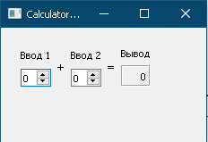
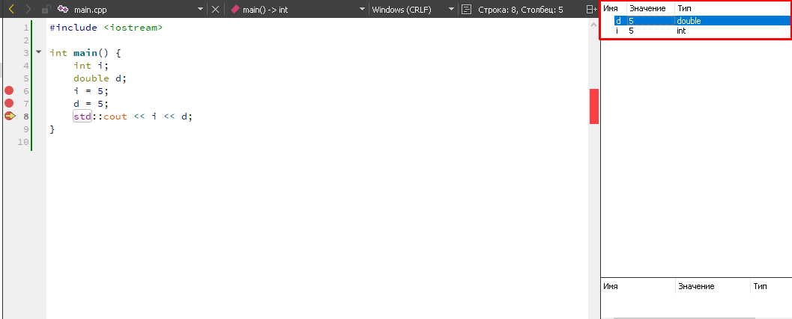

МИНИСТЕРСТВО НАУКИ  И ВЫСШЕГО ОБРАЗОВАНИЯ РОССИЙСКОЙ ФЕДЕРАЦИИ 
Федеральное государственное автономное образовательное учреждение высшего образования 
"КРЫМСКИЙ ФЕДЕРАЛЬНЫЙ УНИВЕРСИТЕТ им. В. И. ВЕРНАДСКОГО" 
ФИЗИКО-ТЕХНИЧЕСКИЙ ИНСТИТУТ 
Кафедра компьютерной инженерии и моделирования

 
<h3 align="center">Отчёт по лабораторной работе № 4  по дисциплине "Программирование"</h3>

  

студента 1 курса группы ИВТ-б-о-202(2) 
Вакарева Максима Викторовича 
направления подготовки 09.03.01 "Информатика и вычислительная техника"

  
<table>
<tr><td>Научный руководитель  старший преподаватель кафедры  компьютерной инженерии и моделирования</td>
<td>(оценка)</td>
<td>Чабанов В.В.</td>
</tr>
</table>
  

Симферополь, 2021

### Цель:

Настроить рабочее окружение, для разработки программного обеспечения при помощи Qt и IDE Qt Creator, а также изучить базовые возможности данного фреймворка.

## Постановка задачи

Настроить рабочее окружение, для разработки программного обеспечения при помощи Qt и IDE Qt Creator, а также изучить базовые возможности данного фреймворка.

## Выполнение работы

#### Задание 1.

Скачал и установил Qt Creator с официального сайта разработчика. Выбрал пример **Calculator Form Example**. На боковой панели в разделе **Проекты** в каталоге **Формы** открыл главную форму проекта и заменил текст "Input 1", "Input 2", "Output" на "Ввод 1", "Ввод 2" и "Вывод" соответственно. Запустил отредактированную программу (см. рис. 1).

 Рисунок 1 - Отредактированный пример программы 

#### Задание 2.

1. Как изменить цветовую схему (оформление) среды?
Нажать на вкладку "Инструменты" и открыть "Параметры", в окне параметров выбрать "Среда". Открыть вкладку "Интерфейс" и изменить параметр "Цвет".
2. Как закомментировать/раскомментировать блок кода средствами Qt Creator? Имеется ввиду комбинация клавиш или пункт меню.
С помощью комбинации клавишь Ctrl+/ или выделить необходимый фрагмент кода, нажать ПКМ и в контекстном меню выбрать "Закоментровать/раскоментровать"
3. Как открыть в проводнике Windows папку с проектом средствами Qt Creator?
Выбрать файл проекта или необходимый исходный файл в разделе "Проекты" нажать на него ПКМ и в контестном меню выбрать "Показать в проводнике"
4. Какое расширение файла-проекта используется Qt Creator? Может быть несколько ответов.
В зависимости от системы сброки расширений файла-проекта может быть: .pro для qmake, .txt для cmake, .qbs для Qbs.
5. Как запустить код без отладки?
Комбинацией клавиш Ctrl+R, либо на владке "Сборка" выбрать "Запустить". Так же можно нажать на зеленый значек запуска в левом нижнем углу программы.
6. Как запустить код в режиме отладки?
Клавишей F5, либо на владке "Отладка" выбрать "Начать отладку". Так же можно нажать на зеленый значек запуска с жучком в левом нижнем углу программы.
7. Как установить/убрать точку останова (breakpoint)?
Нажать левее номера строки на которой необходимо поставить/убрать точку останова.

#### Задание 3.

Скопировал шаблон программы из задания, расставил точки останова, и запустил отладку. В правом углу программы наблюдал изменение значений переменных (см. рис. 2).

- В 6 строке программы переменная i = 0, а переменная d = 8.7751592236638808e-318;

- В 7 строке программы переменная i = 5, а переменная d = 8.7751592236638808e-318;

- В 8 строке программы переменная i = 5 и переменная d = 5;

 Рисунок 2 - Изменение значений перменных в режиме отладки 

  

**Вывод:** Приобрел опыт работы с новым для меня IDE, Qt Creator. Подробнее узнал о сборщиках кода. Настроил рабочее окружение, для разработки программного обеспечения при помощи Qt и IDE Qt Creator, а также изучил базовые возможности данного фреймворка. Узнал о возможностиях Qt для разработки кроссплатформенных приложений.