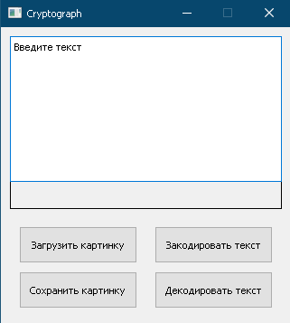
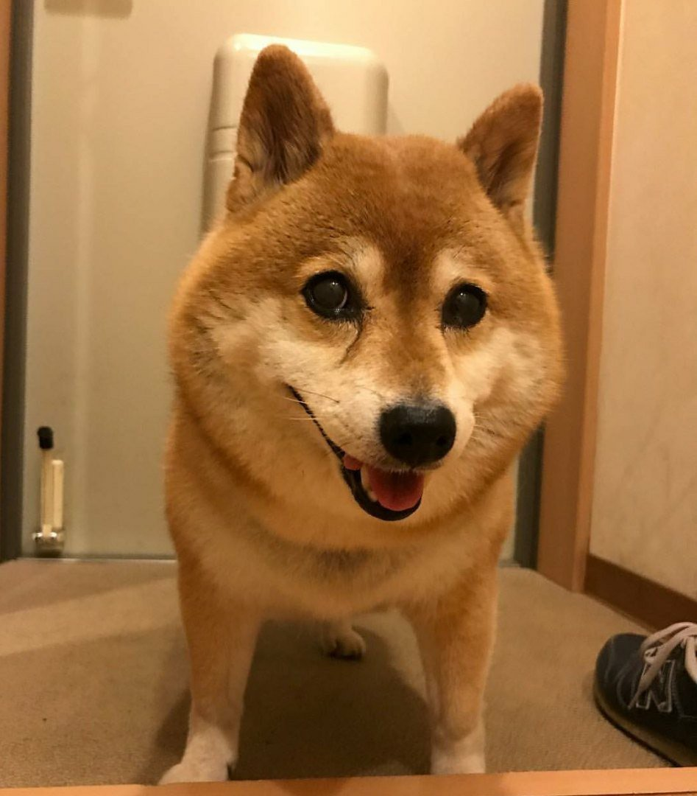

МИНИСТЕРСТВО НАУКИ  И ВЫСШЕГО ОБРАЗОВАНИЯ РОССИЙСКОЙ ФЕДЕРАЦИИ 
Федеральное государственное автономное образовательное учреждение высшего образования 
"КРЫМСКИЙ ФЕДЕРАЛЬНЫЙ УНИВЕРСИТЕТ им. В. И. ВЕРНАДСКОГО" 
ФИЗИКО-ТЕХНИЧЕСКИЙ ИНСТИТУТ 
Кафедра компьютерной инженерии и моделирования

 
<h3 align="center">Отчёт по лабораторной работе № 5  по дисциплине "Программирование"</h3>

  

студента 1 курса группы ИВТ-б-о-202(2) 
Вакарева Максима Викторовича 
направления подготовки 09.03.01 "Информатика и вычислительная техника"

  

<table>
<tr><td>Научный руководитель  старший преподаватель кафедры  компьютерной инженерии и моделирования</td>
<td>(оценка)</td>
<td>Чабанов В.В.</td>
</tr>
</table>
  

Симферополь, 2021

### Цель:

1. Изучить базовые встроенные элементы фреймворка Qt предназначенные для создания приложений с графическим интерфейсом пользователя (GUI);
2. Изучить сигнально-слотовую систему, как один из способов организации взаимодействия компонентов GUI;
3. Получить практический навык работы с побитовыми операторами.

## Постановка задачи

Создать десктоп приложение с GUI позволяющее сохранять текстовую информацию в изображение формата png без видимого изменения исходного изображения. Приложение должно позволять сохранять текст в картинку и извлекать текст из картинки.

## Выполнение работы

С помощью Qt Designer был разработан пользовательский интерфейс. Далее этот интерфейс был использован при разработке приложения на языке C++ и Python. Для языка C++ использовался созданный в Qt Designer файл c расширением .ui, для Python данный интерфейс был экспортирован в класс и использован в коде ввиде класса (см. рис. 1).

 Рисунок 1 - Разработанный  интерфейс программы 

Далее был разработан алгоритм загрузки и сохранения картинок, шифрования и дешифрования сообщений из картинок. С помощью алгоритма шифрования  было зашифрованно сообщения в рисунок 2, а с помощью алгоритма дешифрования я увидел зашифрованное сообщение из картинки данной в задании с новым трейлером Grand Theft Auto VI от Rick Astley.

 Рисунок 2 - Картинка с зашифрованным сообщением 

**Вывод**: Изучил базовые встроенные элементы фреймворка Qt предназначенные для создания приложений с графическим интерфейсом пользователя. Изучил сигнально-слотовую систему, как один из способов организации взаимодействия компонентов GUI. Получил практический навык работы с побитовыми операторами. Изучил принцип работы с изображениями в Qt. Получил опыт работы с Qt PySide.